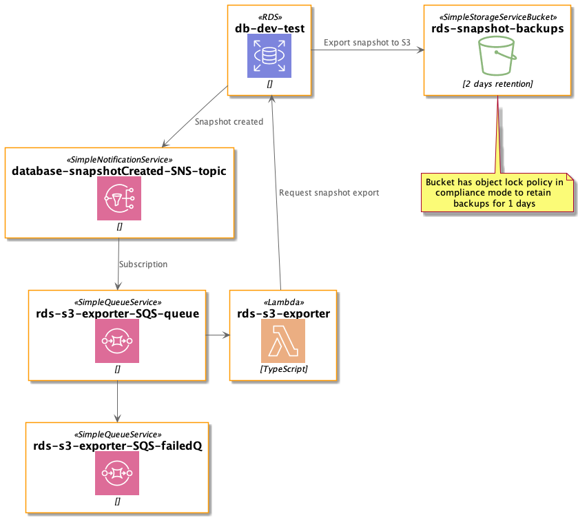

<div align="center">


# RDS Snapshot S3 Exporter

</div>

Exports postal-returns DB snapshots to an S3 bucket with an object lock in compliance mode for 2 days. Objects in that S3 bucket have retention period of 1 days (COMPLIANCE mode), which restricts files to be deleted by any user (even root user) before end of retention period.

## Architecture



[PlantUml source](./docs/architecture.puml)

## Example of event

```json
{
    "Event Source": "db-snapshot",
    "Event Time": "2021-12-01 15:53:42.823",
    "Identifier Link": "https://console.aws.amazon.com/rds/home?region=eu-west-1#snapshot:id=test-snapshottttt",
    "Source ID": "test-snapshottttt",
    "Source ARN": "arn:aws:rds:eu-west-1:123123123123:snapshot:test-snapshottttt",
    "Event ID": "http://docs.aws.amazon.com/AmazonRDS/latest/UserGuide/USER_Events.html#RDS-EVENT-0042",
    "Event Message": "Manual snapshot created"
}
```

## Accepted Snapshots Prefixes (Source ID):

- rds:db-${env}-test

## Accepted Snapshots Event Types (Event Message):

- "Manual snapshot created"
- "Automated snapshot created"

## Testing

For running Unit Tests please use following command:

```bash
npm test
```

For running Acceptance Tests please use following command:

```bash
npm test:acceptance:dev
```
> NOTE: There is an acceptance test for success scenario which is in skipped state. It is marked as skipped because AWS will throw ExportTaskAlreadyExists exception if lambda will try to create new Export Task on snapshot which already has In Progress export task 
